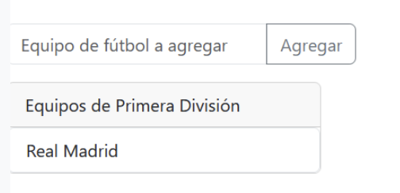

## Ejercicio 4 (tarea2.5 del profesor)

Donde se insertan en una lista ordenada los equipos que el usuario introduce en el input.

Realiza la funcionalidad javascript necesaria para que realice esa operación. Parte de un html donde aparecen todos los items de la captura.

Además, investigando, deberás agregar un botón llamado por ejemplo "Borrar Lista", el cual, cuando se haga clic borre todos los items de la lista no ordenada.

---

### Realizado por: Anabel Montero Díaz

