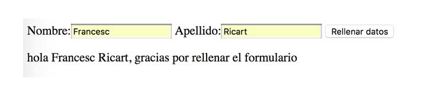

### Ejercicio 1 de Internet

Dado el código HTML a continuación termina de rellenarlo para tras rellenar los campos de nombre y apellido y hacer clic en enviar datos aparezca por pantalla el texto «hola nombre apellidos, gracias por rellenar el formulario».

Ver imagen adjunta.



```
<!DOCTYPE html>
<html>
    <head>
        <meta charset="utf-8">
        <meta name="description" content="Llamar y rellenar cajetines de texto">
        <meta name="author" content="Francesc Ricart">
        <title>Ejercicio javascript - Instrucciones básicas DOM</title>
    </head>
    <body>
    
    <form action="#saludo">
        <label for="nombre">Nombre:</label><input type="text" id="nombre">
        <label for="apellido">Apellido:</label><input type="text" id="apellido">
        <input type="submit" value="Rellenar datos" onclick="enviarSaludo()">     
    </form>
    
    <p id="saludo"></p>
    
    <script>
    
        function enviarSaludo(){
        }
    </script>

    </body>
</html>

```
---
### Realizado por: Anabel Montero Díaz

