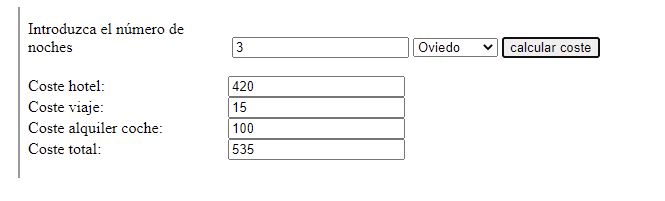

### Ejercicio 4 de Internet

Vamos a hacer una aplicación que se encargará de calcular el coste de un viaje. Para ello tendremos una función llamada calculateCost que llamará a otras tres funciones.

Cada una de estas tres funciones hará un cálculo de un coste parcial del viaje. La suma de los tres costes será el coste total del viaje.

El código HTML quedaría así:

calculateCost()

